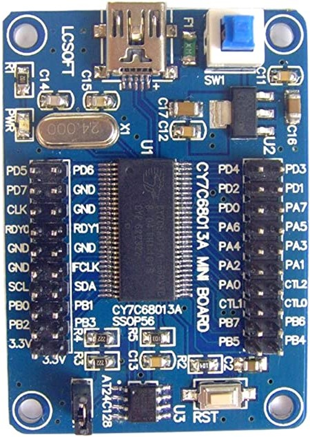

# Playing with the CY7C68013A from Cypress

Its a versatile USB2.0 High-Speed 480Mbit capable processor to interface various hardware.

Mostly used for the Sigrok logic analyzer.

You get these boards cheaply on ebay or aliexpress for around 3 to 5$.

My first experiments are to implement USB-to-serial adapter.

- VirtualComportCypress is a **CDC** Virtual Comport and uses its own Cypress driver on Windows.
On linux it appears as ttyACM0 tty device.

- **FTserial** is a FT232R device simulator and uses the FTDI driver on Windows.
On Linux it appears as /dev/ttyUSB0

I am using the Keil compiler. 
There is also SDCC and fx2lib available, but we dont really need a lib.

Have fun ;) xenpac